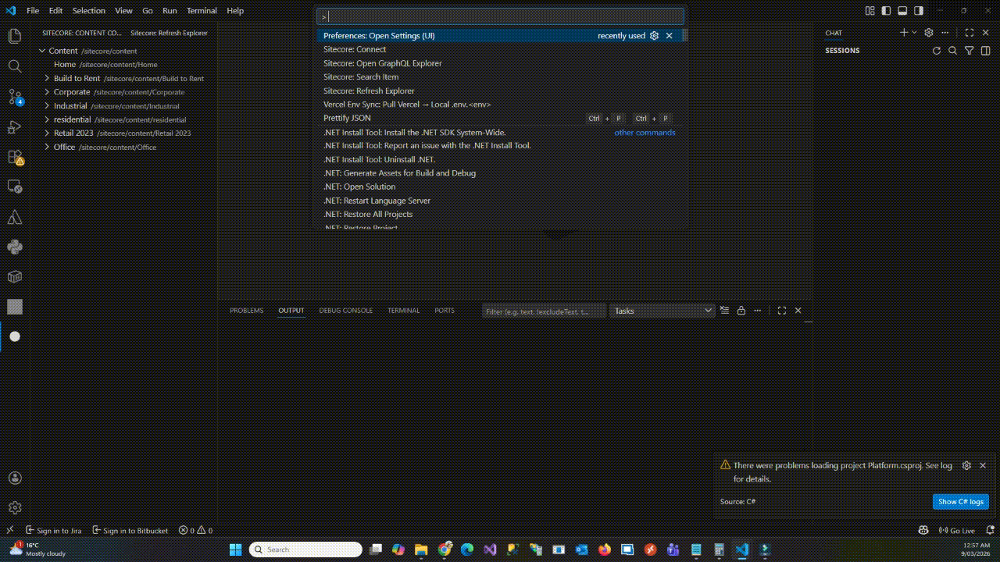
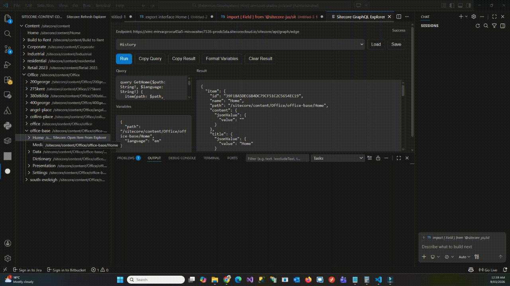
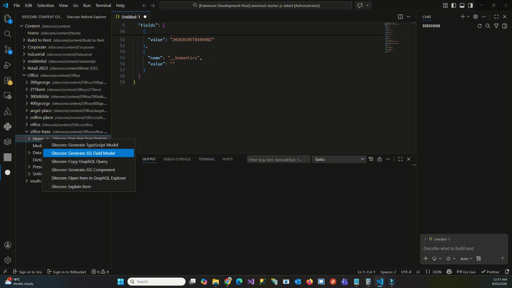

# Sitecore Content Copilot

Sitecore Content Copilot is a **VS Code extension for Sitecore XM Cloud and Headless developers** that helps you explore content, generate code, run GraphQL queries, and understand Sitecore items faster — now with optional **AI-powered insights**.

<a href="https://marketplace.visualstudio.com/items?itemName=arif-cmslightaustraliaptyltd.sitecore-content-copilot"></a>


This extension improves developer productivity when working with **Sitecore JSS, XM Cloud, and GraphQL APIs**.

---

# ✨ Key Features

## 📂 Sitecore Content Explorer

Browse Sitecore content items directly inside VS Code.

- Navigate Sitecore content tree
- Search items
- Inspect item fields

---

## ⚡ Developer Productivity Tools

Quick actions available from the explorer.

### Copy Route Path
Instantly copy the route for a page item.

Example:
/sitecore/content/siteA/home/about-us
↓
/about-us
---

### Copy Item ID
Copy the GUID of a Sitecore item directly to the clipboard.

---

### Copy Layout Query
Generate a ready-to-run GraphQL layout query for debugging rendering.

Example query:

```graphql
query LayoutQuery($site: String!, $routePath: String!, $language: String!) {
  layout(site: $site, routePath: $routePath, language: $language) {
    item {
      rendered
    }
  }
}

### Rendering Host Integration
Preview pages directly in your headless rendering host.

Right-click any page item and choose:

Open in Rendering Host

Example:

/sitecore/content/siteA/home/about-us
↓
http://localhost:3000/about-us

Routes are automatically generated from the Sitecore content path.

### Personalize Trigger Analyzer

Debug Sitecore Personalize experiences directly from VS Code.

You can:

simulate session events

test trigger rules

analyze why an experience did or didn’t trigger

Example rule:

user visits 3 distinct pages

The extension analyzes event payloads and provides a diagnostic report.

Optional:

paste guest JSON

load guest by guest reference


# ✨ Some Features in Action




---

## GraphQL Explorer

Run GraphQL queries directly against your Sitecore endpoint.



---

## Others

Generate component instantly.




Browse Sitecore content directly inside VS Code.

* Explore the `/sitecore/content` tree
* Expand items and inspect structure
* Open item JSON quickly
* Developer-friendly navigation for headless projects

---

## GraphQL Explorer

Run GraphQL queries directly against your Sitecore endpoint.

Features include:

* Query editor
* Variables editor
* Result viewer
* Query history
* Prettify GraphQL queries
* Copy query / copy results
* Format variables
* Run query with **Ctrl/Cmd + Enter**


---

## Open Item in GraphQL Explorer

Right-click a Sitecore item and automatically open it inside the GraphQL playground.

The extension will:

* generate a starter query
* prefill query variables
* allow immediate execution

This significantly speeds up debugging GraphQL responses.

---

## Generate JSS Field Models

Generate **TypeScript field models** for Sitecore items.

Example output:

```ts
export type HeroBannerFields = {
  title: TextField;
  description: RichTextField;
  heroImage: ImageField;
  ctaLink: LinkField;
};
```

Useful when building **Sitecore JSS / Next.js components**.

---

## Generate React / Next.js Components

Automatically scaffold a **starter component** from Sitecore fields.

Example:

```tsx
const HeroBanner = ({ fields }: HeroBannerProps) => (
  <section>
    <Text field={fields.title} />
    <RichText field={fields.description} />
  </section>
);
```

Great for accelerating **component development**.

---

## Copy GraphQL Query

Generate a GraphQL query snippet for a selected Sitecore item.

Example:

```graphql
query GetHeroBanner($path: String!, $language: String!) {
  item(path: $path, language: $language) {
    id
    name
    path
  }
}
```

---

# 🤖 AI Features

AI capabilities are **optional** and can be enabled using your own OpenAI API key.

## Explain Item

Right-click a Sitecore item and choose:

```
Explain Item
```

The extension will analyze the item and generate a developer-friendly explanation including:

* what the item likely represents
* explanation of each field
* suggested component usage
* recommended GraphQL usage
* development notes

Example output:

```markdown
# Hero Banner

## Summary
This item represents a homepage hero banner used to highlight key marketing content.

## Fields
title — main heading displayed in the hero section  
description — supporting rich text content  
heroImage — primary visual image  
ctaLink — call-to-action button link

## Suggested Usage
Use this item with a HeroBanner React component.

## GraphQL Usage
Query title, description, heroImage, and ctaLink using jsonValue.
```

This helps developers quickly understand unfamiliar content structures.

---

# ⚙️ Configuration

Open VS Code Settings and configure:

```
Sitecore Copilot
```

or edit `settings.json`.

Example configuration:

```json
{
  "sitecoreCopilot.endpoint": "https://your-xmcloud/graphql",
  "sitecoreCopilot.apiKey": "your-sitecore-api-key",
  "sitecoreCopilot.language": "en",

  "sitecoreCopilot.aiEnabled": true,
  "sitecoreCopilot.aiApiKey": "your-openai-key",
  "sitecoreCopilot.aiModel": "gpt-4.1-mini"
}
```

---

# 🧰 Commands

Available commands:

| Command                         | Description                 |
| ------------------------------- | --------------------------- |
| Sitecore: Connect               | Configure Sitecore endpoint |
| Sitecore: Search Item           | Search Sitecore items       |
| Sitecore: Open GraphQL Explorer | Launch GraphQL playground   |
| Sitecore: Copy GraphQL Query    | Generate GraphQL query      |
| Sitecore: Generate JSS Model    | Generate TypeScript model   |
| Sitecore: Generate Component    | Generate React component    |
| Sitecore: Explain Item          | AI explanation of item      |
| Sitecore: Copy Route Path       | Copy route path             |
| Sitecore: Copy Item ID          | Copy Item ID                |
| Sitecore: Copy Layout Query     | Copy Layout Query           |
| Sitecore Personalize: Analyze Trigger    | Copy Layout Query  |

---

# 📦 Requirements

* Sitecore XM Cloud or GraphQL endpoint
* API key with GraphQL access

Optional:

* OpenAI API key for AI features

---

# 🚀 Roadmap

Planned future improvements:

* Template Explorer
* GraphQL schema introspection
* Generate components from templates
* AI component generator
* AI query suggestions
* GraphQL query runner from editor

---

# 🤝 Contributing

Contributions and feature ideas are welcome.

---

# 📄 License

MIT License
